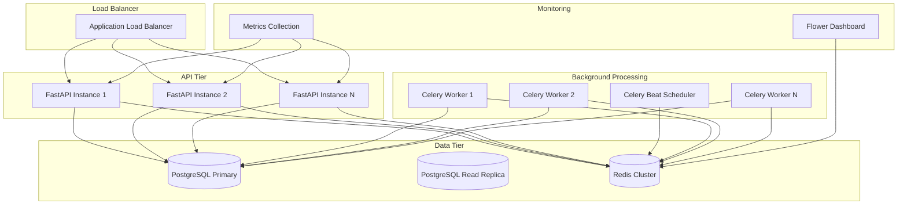
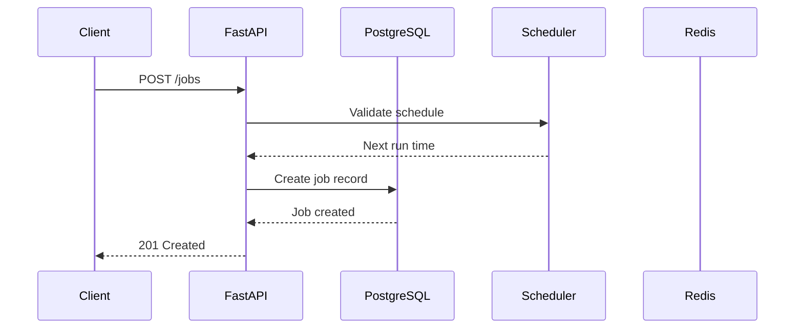
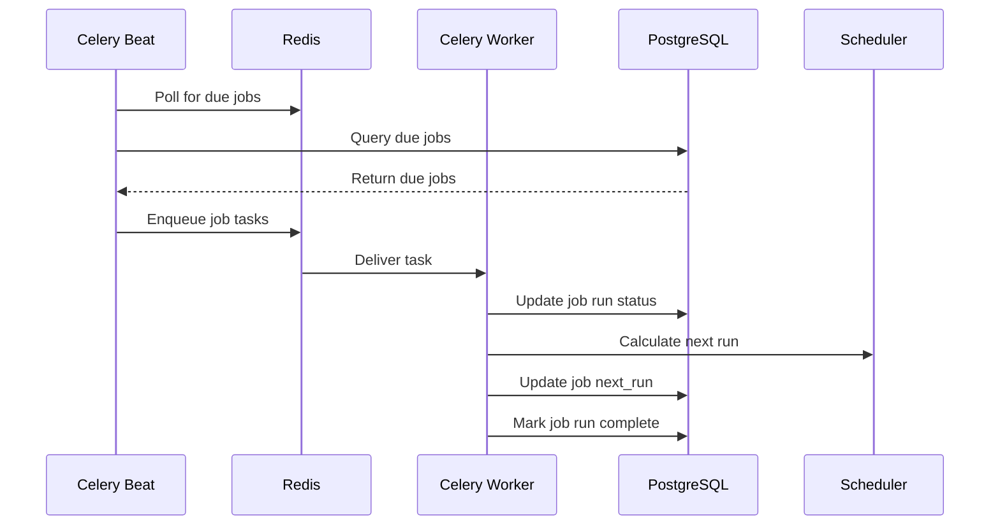

# Architecture and Scaling Guide

##  Current Architecture Overview

The Scheduler Service is built as a microservice following modern architectural patterns with clear separation of concerns and horizontal scalability in mind.

### Core Components



### Technology Stack Rationale

| Component | Technology | Rationale |
|-----------|------------|-----------|
| **API Framework** | FastAPI | High performance, automatic OpenAPI docs, async support |
| **Background Processing** | Celery | Mature, scalable, supports multiple brokers |
| **Database** | PostgreSQL | ACID compliance, JSON support, excellent performance |
| **Message Broker** | Redis | Fast, reliable, supports pub/sub and task queues |
| **Containerization** | Docker | Consistent deployment, easy scaling |
| **Orchestration** | Docker Compose | Simple multi-container management |

##  Data Flow Architecture

### Job Creation Flow


### Job Execution Flow


##  Scaling Strategies

### Horizontal Scaling

#### 1. API Tier Scaling
- **Load Balancer**: Distribute requests across multiple API instances
- **Stateless Design**: No session state stored in API instances
- **Health Checks**: Automatic instance replacement on failure
- **Auto-scaling**: Scale based on CPU/memory usage

#### 2. Worker Tier Scaling
- **Dynamic Worker Scaling**: Add/remove workers based on queue length
- **Worker Specialization**: Different worker pools for different job types
- **Resource Allocation**: CPU/memory limits per worker type
- **Graceful Shutdown**: Allow running tasks to complete before termination

#### 3. Database Scaling
- **Read Replicas**: Distribute read queries across multiple replicas
- **Connection Pooling**: Manage database connections efficiently
- **Query Optimization**: Indexing and query performance tuning
- **Partitioning**: Partition large tables by time or job type

### Vertical Scaling

#### 1. Resource Optimization
- **CPU**: Multi-core processing for parallel job execution
- **Memory**: Caching frequently accessed data
- **Storage**: SSD storage for better I/O performance
- **Network**: High-bandwidth connections for data transfer

#### 2. Performance Tuning
- **Database Tuning**: Query optimization, index tuning
- **Redis Optimization**: Memory usage, persistence settings
- **Celery Configuration**: Worker concurrency, prefetch settings
- **API Optimization**: Response caching, connection pooling

##  High Availability Considerations

### 1. Celery Beat Leader Election
- **Problem**: Multiple Beat instances can cause duplicate job scheduling
- **Solution**: Use database-based leader election or Redis locks
- **Implementation**: 
  ```python
  # Use django-celery-beat for database-backed scheduling
  CELERY_BEAT_SCHEDULER = 'django_celery_beat.schedulers:DatabaseScheduler'
  ```

### 2. Worker Scaling
- **Auto-scaling**: Scale workers based on queue length
- **Worker Health**: Implement health checks and automatic replacement
- **Graceful Shutdown**: Allow running tasks to complete
- **Resource Limits**: Set CPU and memory limits per worker

### 3. API Scaling
- **Load Balancing**: Use ALB with health checks
- **Stateless Design**: No session state in API instances
- **Circuit Breakers**: Implement circuit breakers for external dependencies
- **Rate Limiting**: Implement rate limiting to prevent abuse

### 4. Database High Availability
- **Multi-AZ Deployment**: Deploy RDS in multiple availability zones
- **Read Replicas**: Use read replicas for read-heavy workloads
- **Backup Strategy**: Automated backups with point-in-time recovery
- **Connection Pooling**: Use PgBouncer for connection management

##  Monitoring and Observability

### 1. Metrics Collection
- **Application Metrics**: Job execution rates, success/failure rates
- **Infrastructure Metrics**: CPU, memory, disk usage
- **Database Metrics**: Connection count, query performance
- **Queue Metrics**: Queue length, processing time

### 2. Logging Strategy
- **Structured Logging**: JSON-formatted logs for easy parsing
- **Log Aggregation**: Use CloudWatch Logs or ELK stack
- **Correlation IDs**: Track requests across services
- **Log Levels**: Appropriate log levels for different environments

### 3. Alerting
- **Job Failure Alerts**: Alert on job failures
- **Queue Length Alerts**: Alert when queue length exceeds threshold
- **Resource Alerts**: Alert on high CPU/memory usage
- **Database Alerts**: Alert on connection issues or slow queries

### 4. Distributed Tracing
- **X-Ray Integration**: Trace requests across services
- **Custom Spans**: Add custom spans for business logic
- **Performance Analysis**: Identify bottlenecks and slow operations

##  Deployment Strategies

### 1. Blue-Green Deployment
- **Zero Downtime**: Deploy new version alongside current version
- **Instant Rollback**: Switch traffic back to previous version if issues
- **Database Migrations**: Handle schema changes carefully

### 2. Rolling Deployment
- **Gradual Rollout**: Deploy to subset of instances at a time
- **Health Checks**: Verify new instances before routing traffic
- **Automatic Rollback**: Rollback if health checks fail

### 3. Canary Deployment
- **Traffic Splitting**: Route small percentage of traffic to new version
- **Monitoring**: Monitor metrics and errors closely
- **Gradual Increase**: Increase traffic percentage based on success

##  Security Considerations

### 1. API Security
- **API Key Authentication**: Secure API access with API keys
- **Rate Limiting**: Prevent abuse and DoS attacks
- **Input Validation**: Validate all input data
- **HTTPS**: Encrypt all communication

### 2. Database Security
- **Encryption at Rest**: Encrypt database storage
- **Encryption in Transit**: Use SSL/TLS for database connections
- **Access Control**: Implement proper IAM policies
- **Network Security**: Use VPC and security groups

### 3. Infrastructure Security
- **Secrets Management**: Use AWS Secrets Manager or similar
- **Network Isolation**: Use private subnets for sensitive components
- **Regular Updates**: Keep all components updated
- **Vulnerability Scanning**: Regular security scans

##  Performance Optimization

### 1. Database Optimization
- **Indexing Strategy**: Create appropriate indexes for queries
- **Query Optimization**: Optimize slow queries
- **Connection Pooling**: Use connection pooling
- **Read Replicas**: Distribute read load

### 2. Caching Strategy
- **Redis Caching**: Cache frequently accessed data
- **Application Caching**: Cache job configurations
- **CDN**: Use CDN for static assets

### 3. Queue Optimization
- **Queue Partitioning**: Partition queues by job type
- **Priority Queues**: Implement priority-based processing
- **Dead Letter Queues**: Handle failed jobs gracefully

##  Disaster Recovery

### 1. Backup Strategy
- **Database Backups**: Automated daily backups
- **Configuration Backups**: Backup application configuration
- **Code Backups**: Version control and CI/CD

### 2. Recovery Procedures
- **RTO (Recovery Time Objective)**: Target recovery time
- **RPO (Recovery Point Objective)**: Acceptable data loss
- **Testing**: Regular disaster recovery testing

### 3. Multi-Region Deployment
- **Active-Passive**: Primary region with standby region
- **Active-Active**: Multiple active regions
- **Data Replication**: Replicate data across regions

##  Capacity Planning

### 1. Resource Requirements
- **CPU**: Based on job complexity and concurrency
- **Memory**: Based on data size and caching requirements
- **Storage**: Based on job history and log retention
- **Network**: Based on data transfer requirements

### 2. Scaling Triggers
- **Queue Length**: Scale workers when queue length exceeds threshold
- **CPU Usage**: Scale API instances when CPU usage is high
- **Memory Usage**: Scale when memory usage exceeds threshold
- **Response Time**: Scale when response time degrades

### 3. Cost Optimization
- **Right-sizing**: Use appropriate instance types
- **Reserved Instances**: Use reserved instances for predictable workloads
- **Spot Instances**: Use spot instances for non-critical workloads
- **Auto-scaling**: Scale down during low usage periods

##  Future Enhancements

### 1. Advanced Scheduling
- **Dependency Management**: Job dependencies and workflows
- **Conditional Execution**: Conditional job execution based on results
- **Dynamic Scheduling**: Adjust schedules based on load

### 2. Enhanced Monitoring
- **Real-time Dashboards**: Live monitoring dashboards
- **Predictive Analytics**: Predict job failures and performance issues
- **Anomaly Detection**: Detect unusual patterns in job execution

### 3. Multi-tenancy
- **Tenant Isolation**: Isolate jobs by tenant
- **Resource Quotas**: Limit resources per tenant
- **Billing Integration**: Track usage per tenant

### 4. Advanced Job Types
- **Batch Jobs**: Process large datasets in batches
- **Streaming Jobs**: Process real-time data streams
- **ML Jobs**: Machine learning model training and inference
